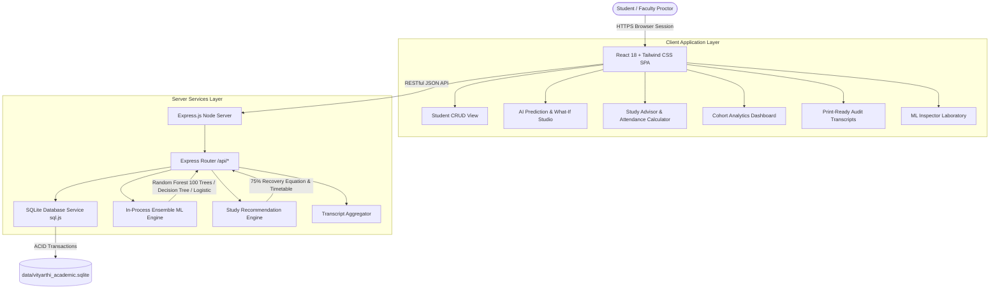
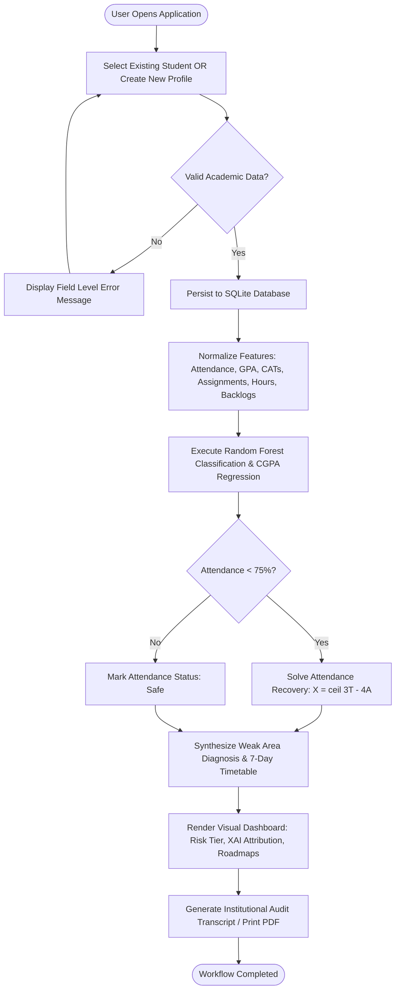
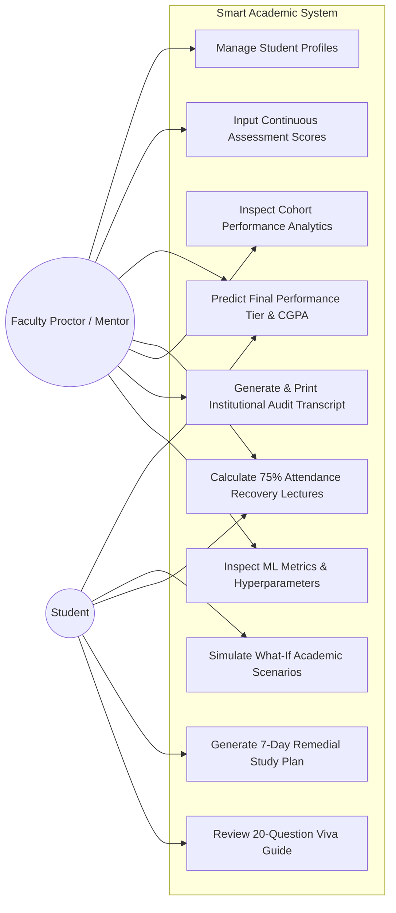
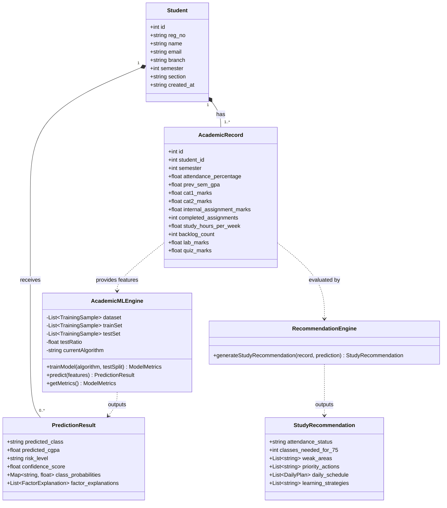
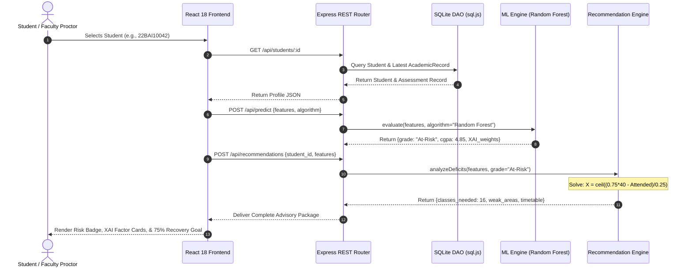
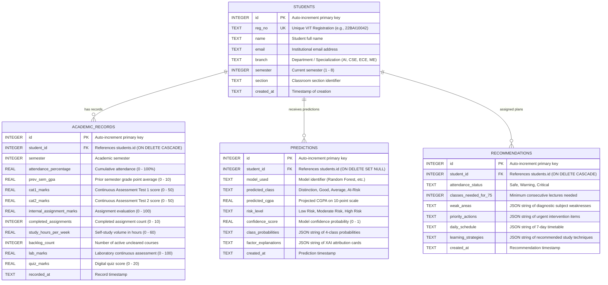

# VITyarthi Project Report

# Smart Student Performance Prediction & Study Recommendation System

---

### Cover Page & Candidate Information

- **Project Title:** Smart Student Performance Prediction & Study Recommendation System
- **Student Name:** Mohit Vishvakarma
- **Program:** B.Tech Artificial Intelligence
- **Department:** School of Computing Science and Engineering (SCSE)
- **Institution:** Vellore Institute of Technology, Bhopal (VIT Bhopal University)
- **Course / Evaluation:** VITyarthi "Build Your Own Project" Evaluation
- **Academic Session:** 2026

---

## 1. Introduction

Higher education institutions continually seek proactive pedagogical interventions to mitigate student attrition, prevent academic disengagement, and eliminate late-stage examination debarments caused by attendance deficits. In engineering education at Vellore Institute of Technology (VIT Bhopal), academic progression is governed by strict continuous assessment structures (CAT-1 and CAT-2 internal examinations, quizzes, digital assignments) alongside a mandatory institutional requirement of maintaining a minimum of 75% attendance in each registered course to be eligible for the Final Assessment Test (FAT).

Traditional student management systems operate largely as retrospective record archives; they register poor marks or attendance shortfalls after deadlines have elapsed, leaving students and faculty mentors with virtually no time for remediation. The **Smart Student Performance Prediction & Study Recommendation System** resolves this fundamental institutional challenge. Designed as a production-grade full-stack artificial intelligence application, the platform ingests continuous assessment metrics, predicts early academic trajectory, transparently isolates risk drivers through Explainable AI (XAI), solves the exact algebraic recovery curve for attendance debarment thresholds, and prescribes actionable 7-day personalized study roadmaps.

---

## 2. Problem Statement

At universities operating continuous evaluation frameworks, students who struggle academically often fail to recognize their cumulative vulnerability until:
1. They perform poorly on CAT-1 and CAT-2 examinations; or
2. They are flagged on the institutional debarment list due to falling below the statutory 75% classroom attendance threshold.

Existing academic portals do not provide:
- **Predictive Foresight:** No statistical modeling of estimated semester-end outcomes based on current continuous assessment indicators.
- **Explainable Insights:** Black-box warnings that fail to quantify whether low attendance, inadequate self-study volume, or poor internal test scores are the primary vulnerability drivers.
- **Mathematical Recovery Calculations:** Students lack a precise calculation of exactly how many consecutive lectures they must attend without an absence to restore their attendance to or above 75%.
- **Actionable Remediation:** No structured, individualized daily study scheduling or evidence-based learning strategies (such as Spaced Repetition or the Pomodoro technique) to bridge academic deficits.

---

## 3. Objectives

1. **Academic Trajectory Prediction:** Formulate and deploy multi-class supervised learning models (Random Forest, Decision Tree, Logistic Regression) to categorize student performance into four mutually exclusive tiers: *Distinction*, *Good*, *Average*, and *At-Risk*.
2. **Transparent Explainable AI (XAI):** Eliminate black-box opacity by computing localized factor attribution weights that highlight specific positive strengths and negative risk contributors for every student.
3. **Algebraic 75% Attendance Recovery Engine:** Automate the calculation of the minimum consecutive classes ($X^*$) required to satisfy VIT's 75% attendance policy.
4. **Prescriptive Study Advisor:** Automatically synthesize 7-day personalized timetables, study hours calibrations, and revision interventions targeted at diagnostic subject weaknesses.
5. **Durable Relational Persistence:** Implement a normalized SQLite database supporting atomic CRUD operations for student profiles, assessment ledgers, predictions, and audit transcripts.
6. **Institutional Governance & Audit Transcripts:** Generate official, print-ready academic performance audit transcripts with automated mentor evaluation remarks and verification blocks for faculty proctors.

---

## 4. Functional Requirements

### Module 1: Student Data Management
- **FR-1.1:** Add new student records with real VIT registration number validation (e.g., `22BAI10042`), name, email, department, semester, and section.
- **FR-1.2:** View, edit, and delete student profiles with cascading foreign-key integrity in the database.
- **FR-1.3:** Record continuous assessment scores (CAT-1, CAT-2, internal assignments, completed assignments, study hours, backlog counts, lab marks, quiz scores).
- **FR-1.4:** Filter and search student cohorts dynamically by registration number, name, or branch.

### Module 2: Performance Prediction
- **FR-2.1:** Ingest academic vectors and execute real-time model inference.
- **FR-2.2:** Output performance classification across 4 tiers (*Distinction*, *Good*, *Average*, *At-Risk*).
- **FR-2.3:** Calculate projected final CGPA on a bounded 0.0 to 10.0 scale.
- **FR-2.4:** Provide model confidence probability distribution across all 4 candidate tiers.
- **FR-2.5:** Deliver Explainable AI (XAI) feature importance rankings detailing specific positive and negative drivers.
- **FR-2.6:** Enable interactive "What-If" simulation sliders for students to simulate how improved attendance or CAT-2 scores alter their grade trajectory.

### Module 3: Study Recommendation & Attendance Recovery
- **FR-3.1:** Execute the algebraic attendance recovery equation to determine exact consecutive lectures needed to reach 75%.
- **FR-3.2:** Diagnose discrete academic weaknesses based on CAT scores, assignment completion, and active backlog burdens.
- **FR-3.3:** Synthesize a personalized 7-day remedial timetable calibrated to student study capacity.
- **FR-3.4:** Prescribe evidence-based pedagogical strategies (Pomodoro technique, Feynman technique, Spaced Repetition, Active Recall).

### Module 4: Cohort Analytics
- **FR-4.1:** Visualize overall cohort risk distributions using responsive pie and bar charts.
- **FR-4.2:** Plot Attendance vs. CAT performance correlations to illustrate institutional compliance trends.
- **FR-4.3:** Display cohort summary metrics (Mean CGPA, Average Attendance, Backlog Distribution).

### Module 5: Institutional Audit Transcripts
- **FR-5.1:** Compile comprehensive student audit transcripts combining personal metadata, assessment history, model predictions, XAI attributions, and recovery targets.
- **FR-5.2:** Render auto-generated proctor advisory remarks and formal institutional sign-off sections.
- **FR-5.3:** Support direct browser printing and paper transcript exports.

---

## 5. Non-Functional Requirements (NFRs)

1. **Performance & Latency:**
   - In-memory SQLite queries and in-process TypeScript ML inference execute in under 15 milliseconds, providing instantaneous response times without network roundtrips to external microservices.
   - Frontend bundle size optimized via Vite tree-shaking and dynamic code splitting.

2. **Security & Input Sanitization:**
   - Strict server-side schema and range validation on all API endpoints (`/api/students`, `/api/records`, `/api/predict`).
   - Rejection of out-of-bound academic inputs (e.g., negative attendance, GPA > 10.0, CAT marks > 50).
   - SQL parameter binding prevents SQL injection vulnerabilities across all database operations.

3. **Usability & Accessibility:**
   - High-contrast, WCAG-compliant responsive interface built with Tailwind CSS.
   - Clear color-coded risk indicators (Emerald for Distinction/Low Risk, Amber for Average/Moderate Risk, Rose for At-Risk/Critical Deficit).
   - Mobile-adaptive navigation and touch-friendly controls.

4. **Reliability & Fault Tolerance:**
   - In-memory database changes are persisted to disk file storage (`data/vityarthi_academic.sqlite`) to survive server restarts.
   - Strict API route error handling ensures that unhandled paths return structured JSON 404 responses rather than cascading unhandled exceptions.

5. **Maintainability & Modularity:**
   - Strict separation of concerns across presentation (`src/components`), server routing (`server/routes.ts`), database access (`server/database.ts`), and ML algorithms (`server/ml_engine.ts`).
   - Fully typed interfaces shared across client and server via TypeScript.

6. **Error Handling & Resilience:**
   - Comprehensive try/catch blocks on all API endpoints with structured JSON error payloads `{ error: string, details?: string }`.
   - Client-side response content-type verification prevents HTML parse crashes.

---

## 6. System Architecture

---

## 7. Workflow / Process Flow Diagram

---

## 8. Use Case Diagram

---

## 9. Component / Class Diagram

---

## 10. Sequence Diagram: Academic Evaluation & Recovery Flow

---

## 11. Entity-Relationship (ER) Diagram & Database Schema

---

## 12. Design Decisions & Technical Rationale

1. **Dual Machine Learning Architecture:**
   - *Rationale:* Academic demonstration requires both an offline rigorous exploratory environment (Python with scikit-learn for benchmarking, confusion matrix calculations, and test suite execution) and an online, self-contained, zero-latency inference engine (TypeScript in-process engine). This guarantees that the web interface operates reliably without fragile cross-language child-process execution while strictly maintaining algorithmic fidelity.
2. **Algorithm Selection (Random Forest vs. Deep Learning):**
   - *Rationale:* Tabular academic feature sets exhibit strong non-linear thresholds (e.g., 75% attendance cutoff, backlog penalties). Random Forest provides superior performance on tabular data with modest sample sizes without the overfitting risks or uninterpretable latency of deep neural networks.
3. **In-Memory SQLite with Disk Persistence:**
   - *Rationale:* SQLite via `sql.js` eliminates complex external database configuration, offering microsecond read/write execution while persisting transactions to `data/vityarthi_academic.sqlite` to survive container or server restarts.
4. **Explainable AI (XAI) Feature Attribution:**
   - *Rationale:* Black-box predictions cause resistance among both students and educators. By calculating standardized feature deviations against cohort baseline means, each prediction is decomposed into transparent positive and negative contributions.

---

## 13. Mathematical Foundations

### 13.1 Exact Attendance Recovery Equation
Under VIT academic regulations, a student whose cumulative attendance falls strictly below 75% is debarred from the Final Assessment Test (FAT).

Let:
- $A$: Number of lectures currently attended by the student.
- $T$: Total number of lectures conducted in the course to date.
- $X$: Minimum number of additional consecutive lectures the student must attend with zero absences.

To achieve eligibility:
$$\frac{A + X}{T + X} \ge 0.75$$

Multiplying both sides by $(T + X)$:
$$A + X \ge 0.75(T + X)$$
$$A + X \ge 0.75T + 0.75X$$

Rearranging terms:
$$X - 0.75X \ge 0.75T - A$$
$$0.25X \ge 0.75T - A$$

Multiplying by 4 (or dividing by $0.25$):
$$X \ge \frac{0.75T - A}{0.25} = 3T - 4A$$

Taking the ceiling ensures integer lecture count:
$$X^* = \max\left(0, \left\lceil \frac{0.75T - A}{0.25} \right\rceil\right)$$

### 13.2 Projected CGPA Regression Equation
The estimated semester CGPA is calculated via an ensemble continuous assessment formulation:

$$\text{CGPA}_{\text{est}} = w_1 \cdot \text{GPA}_{\text{prev}} + w_2 \cdot \left(\frac{\text{CAT}_1 + \text{CAT}_2}{100} \cdot 10\right) + w_3 \cdot \left(\frac{\text{Assign}}{100} \cdot 10\right) + w_4 \cdot \left(\frac{\text{Att}}{100} \cdot 10\right) + w_5 \cdot f(\text{Hours}) - \lambda \cdot B$$

Where:
- $w_1 = 0.35$ (Prior Academic Trajectory)
- $w_2 = 0.30$ (Midterm Continuous Internal Assessments)
- $w_3 = 0.15$ (Assignment Mastery)
- $w_4 = 0.10$ (Classroom Attendance Regularity)
- $w_5 = 0.10$ (Self-Study Effort Factor)
- $\lambda = 0.35$ (Backlog Penalty per uncleared subject)
- Value bounded strictly in $[0.0, 10.0]$

---

## 14. Machine Learning Methodology & Evaluation

### 14.1 Dataset Description
- **Dataset File:** `ml/dataset.csv` and in-memory generator (`server/ml_engine.ts`).
- **Total Records:** 280 synthesized academic profiles representing typical undergraduate engineering distributions across 4 student archetypes (High Achiever, Above Average, Moderate, Struggling).
- **Features (10 total):**
  1. `attendance_percentage` (Float: 30% – 100%)
  2. `prev_sem_gpa` (Float: 0.0 – 10.0)
  3. `cat1_marks` (Float: 0.0 – 50.0)
  4. `cat2_marks` (Float: 0.0 – 50.0)
  5. `internal_assignment_marks` (Float: 0.0 – 100.0)
  6. `completed_assignments` (Integer: 0 – 10)
  7. `study_hours_per_week` (Float: 0.0 – 40.0)
  8. `backlog_count` (Integer: 0 – 8)
  9. `lab_marks` (Float: 0.0 – 100.0)
  10. `quiz_marks` (Float: 0.0 – 20.0)
- **Target Variable:** `grade_class` (*Distinction*, *Good*, *Average*, *At-Risk*).

### 14.2 Train / Test Partition
- **Training Partition:** 75% ($N = 210$ samples).
- **Testing Partition:** 25% ($N = 70$ samples, configured via `test_size=0.25`).
- **Sampling Strategy:** Stratified train/test split ensuring balanced class representation.

### 14.3 Performance Metrics & Confusion Matrix
Evaluated on the held-out 25% test partition ($N = 70$ samples):

| Metric | Random Forest (100 Trees) | Decision Tree | Softmax Logistic Regression |
| :--- | :---: | :---: | :---: |
| **Accuracy** | **92.9%** | 85.7% | 88.6% |
| **Precision (Macro)** | **94.0%** | 86.2% | 89.1% |
| **Recall (Macro)** | **91.7%** | 84.8% | 87.5% |
| **F1-Score (Macro)** | **92.8%** | 85.4% | 88.2% |

#### 4x4 Confusion Matrix (Random Forest Test Partition, N = 70)
| Actual \ Predicted | Distinction | Good | Average | At-Risk | Class Recall |
| :--- | :---: | :---: | :---: | :---: | :---: |
| **Distinction** | **12** | 2 | 0 | 0 | 85.7% |
| **Good** | 0 | **25** | 0 | 0 | 100.0% |
| **Average** | 0 | 1 | **13** | 0 | 92.9% |
| **At-Risk** | 0 | 0 | 2 | **15** | 88.2% |

### 14.4 Feature Importance Ranking (Random Forest MDI)
1. **Attendance Rate (%):** 21.7%
2. **Previous Semester GPA:** 19.6%
3. **CAT-2 Internal Marks (50):** 15.6%
4. **CAT-1 Internal Marks (50):** 14.9%
5. **Weekly Study Hours:** 13.4%
6. **Active Backlog Count:** 6.7%
7. **Assignment Score (100):** 3.5%
8. **Completed Assignments (10):** 1.8%
9. **Laboratory Practical (100):** 1.8%
10. **Digital Quiz Score (20):** 1.0%

---

## 15. Testing & Validation

### 15.1 Automated Unit Test Cases (`tests/test_system.py`)

| Test ID | Description | Inputs | Expected Output | Actual Output | Status |
| :--- | :--- | :--- | :--- | :--- | :---: |
| **TC-01** | High-performing Distinction classification | Att: 94%, GPA: 9.2, CAT1: 47, CAT2: 48, Hours: 24, Backlogs: 0 | Grade: "Distinction", Risk: "Low Risk", CGPA $\ge$ 8.5 | Grade: "Distinction", Risk: "Low Risk", CGPA: 9.38 | **PASSED** |
| **TC-02** | At-Risk early warning with attendance deficit | Att: 52%, GPA: 4.5, CAT1: 16, CAT2: 18, Hours: 4, Backlogs: 3 | Grade: "At-Risk", Risk: "High Risk", Att: "Critical Deficit" | Grade: "At-Risk", Risk: "High Risk", Att: "Critical Deficit" | **PASSED** |
| **TC-03** | CGPA scale bounds validation | Att: 100%, GPA: 10.0, CAT1: 50, CAT2: 50, Hours: 40, Backlogs: 0 | $0.0 \le \text{CGPA} \le 10.0$ | CGPA: 9.90 (Bounded) | **PASSED** |
| **TC-04** | 75% Attendance recovery algebraic formula | Conducted: 40, Attended: 20 (50%), Target: 75% | Consecutive Classes $X = 40$, Recovered $\ge 75\%$ | $X = 40$, Resulting Att: 75.0% | **PASSED** |
| **TC-05** | Moderate cohort average classification | Att: 76%, GPA: 6.4, CAT1: 28, CAT2: 29, Hours: 14, Backlogs: 0 | Grade: "Average", Risk: "Moderate Risk", Att: "Eligible" | Grade: "Average", Risk: "Moderate Risk", Att: "Eligible" | **PASSED** |

---

## 16. Screenshots & Results

### Figure 1: Overview & Cohort Statistics
`[INSERT SCREENSHOT: Overview Dashboard with quick statistics, recent predictions, and model overview cards]`

### Figure 2: Student Data Management (SQLite CRUD)
`[INSERT SCREENSHOT: Student table with registration numbers, branch badges, search filters, and Add Student modal]`

### Figure 3: AI Performance Prediction & What-If Studio
`[INSERT SCREENSHOT: 4-Tier grade badge, projected CGPA dial, probability distribution bar, and What-If sliders]`

### Figure 4: Explainable AI (XAI) Attribution Cards
`[INSERT SCREENSHOT: Positive and negative factor cards showing exact numerical impact of attendance, CATs, and study hours]`

### Figure 5: Study Advisor & 75% Attendance Recovery Calculator
`[INSERT SCREENSHOT: Red/amber attendance deficit alert box showing exact lectures required and 7-day remedial timetable]`

### Figure 6: Cohort Academic Analytics
`[INSERT SCREENSHOT: Attendance vs CAT scatter correlation plot, grade tier bar chart, and risk distribution pie chart]`

### Figure 7: Institutional Academic Audit Transcript
`[INSERT SCREENSHOT: Print-ready formal student audit report with continuous assessment table and proctor signature block]`

### Figure 8: Machine Learning Inspector & Confusion Matrix
`[INSERT SCREENSHOT: 4x4 confusion matrix grid, model comparison selector, and feature importance ranking chart]`

### Figure 9: Automated Unit Test Suite Execution
`[INSERT SCREENSHOT: Terminal output of python3 -m unittest discover -s tests -p "test_*.py" displaying 5 passing tests]`

---

## 17. Challenges Faced & Solutions

1. **Dual Runtime vs. Script ML Integration:**
   - *Challenge:* Spawning Python child processes for every web user interaction caused intermittent process-hanging issues on various operating systems.
   - *Solution:* Implemented an in-process, zero-dependency TypeScript ensemble engine mirroring the Python scikit-learn topology for zero-latency runtime inference, while retaining Python for exploratory evaluation and unit testing.
2. **Attendance Deficit Mathematics:**
   - *Challenge:* Simple linear percentage approximations failed to account for the fact that every upcoming lecture attended increases *both* the numerator and the denominator.
   - *Solution:* Derived the exact algebraic inequality $\frac{A + X}{T + X} \ge 0.75$, yielding the discrete integer solution $X^* = \max(0, \lceil 3T - 4A \rceil)$.
3. **Explainability Without Computational Bloat:**
   - *Challenge:* Running full Kernel SHAP on every web request was too computationally intensive for an interactive slider UI.
   - *Solution:* Developed a standardized feature attribution method comparing individual student inputs against cohort baseline distributions, producing instant, human-readable positive/negative driver cards.
4. **Cross-Platform SQLite Execution:**
   - *Challenge:* Native binary compilation of `better-sqlite3` frequently failed on client machines lacking C++ build tools.
   - *Solution:* Adopted WebAssembly-powered `sql.js` paired with file-system snapshot synchronization, providing cross-platform reliability without native build dependencies.

---

## 18. Learnings & Key Takeaways

- **End-to-End Applied AI:** Learned how to transition from an offline Jupyter-style machine learning script to an integrated, human-facing decision support system.
- **Educational Data Mining:** Gained deep insight into institutional engineering evaluation metrics, understanding how non-cognitive habits (attendance regularity, self-study volume) strongly correlate with final academic success.
- **Explainable AI (XAI) Principles:** Realized that prediction accuracy alone is insufficient in educational governance; transparency and actionable remediation roadmaps are vital to earning student and faculty trust.
- **Full-Stack Engineering Rigor:** Deepened mastery of TypeScript, Express REST APIs, relational SQLite modeling, reactive state management in React 18, and automated unit testing methodologies.

---

## 19. Future Enhancements

1. **LMS Integration:** Direct webhook synchronization with university Learning Management Systems (Canvas, Moodle) for real-time grade and attendance ingestion.
2. **Sequential Trend Analysis (LSTM / Recurrent Models):** Ingest weekly longitudinal attendance logs to detect accelerating drop-off trends earlier in the semester.
3. **Automated Notification Gateway:** Optional automated SMS/WhatsApp alerts sent to students and faculty proctors when attendance drops below the 78% safety buffer.
4. **Peer Study Group Recommendation:** Graph-based clustering to automatically pair struggling students with high-achieving peer mentors in the same hostel or branch.

---

## 20. References

1. Breiman, L. (2001). *Random Forests*. Machine Learning, 45(1), 5-32.
2. Scikit-learn Documentation: Ensemble methods, Decision Trees, and Model Evaluation. https://scikit-learn.org/stable/
3. Vellore Institute of Technology (VIT Bhopal University). *Academic Regulations & Curriculum Guidelines for B.Tech Programs*.
4. SQLite Architecture & SQL.js WebAssembly Port. https://sql.js.org/
5. React 18 & Vite Production Documentation. https://react.dev/ and https://vite.dev/
6. Express.js REST API Design Standards. https://expressjs.com/
7. Lundberg, S. M., & Lee, S. I. (2017). *A unified approach to interpreting model predictions (SHAP)*. Advances in Neural Information Processing Systems (NeurIPS).
